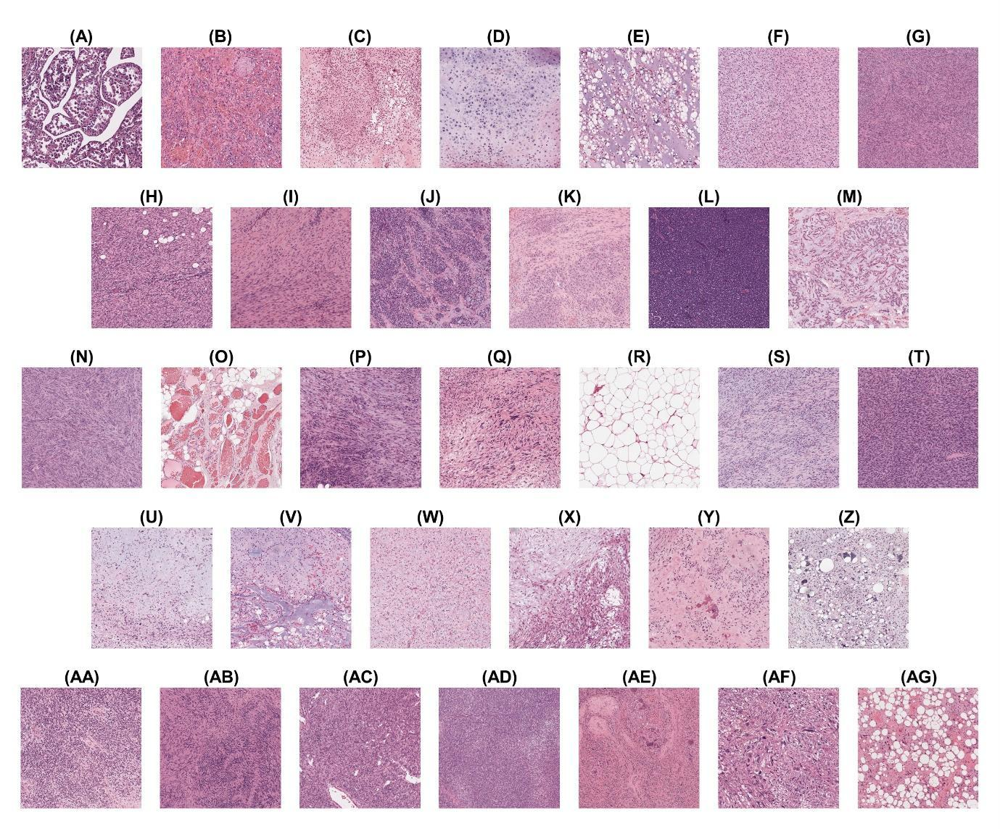

# PAIR-BST

## A region-level histopathology dataset for bone and soft tissue tumors

**Authors:** Gyu Yeong Kim, Yongjun Jeon, Hoyeon Jeong, Donggeon Lee, Seungkyun Lee, Hyungbin Kim, Yurimi Lee, Jihwan Kim, Seog-yun Park, Kyu-Hwan Jung, David Joon Ho, June Hyuk Kim, and Yoon-La Choi

**Affiliations:** Samsung Medical Center · Sungkyunkwan University · National Cancer Center · The State University of New York, Korea

Official code repository for the PAIR-BST dataset benchmark.

[Dataset](https://doi.org/10.25452/figshare.plus.c.8223469) | Paper: link forthcoming | [한국어](README_KO.md)



*Figure 1. Representative H&E-stained regions from the 33 histological diagnosis categories in PAIR-BST.*

## Publication status

PAIR-BST is described in the manuscript *PAIR-BST: A region-level
histopathology dataset for bone and soft tissue tumors*. The manuscript has not
yet been published. A public paper link, final bibliographic record, and BibTeX
entry will be added here after publication.

## Overview

Bone and soft tissue tumors are rare and morphologically heterogeneous, making
their histopathological assessment challenging. PAIR-BST was developed to
support the development and evaluation of computational pathology models for
these tumors, which are underrepresented in existing public benchmarks.

The dataset contains 2,252 pathologist-annotated, 4096 x 4096-pixel regions of
interest (ROIs) derived from 470 whole-slide images (WSIs) from 268 patients.
Each ROI has labels at three complementary levels:

- 33 histological diagnoses;
- 11 lines of differentiation;
- 6 growth patterns.

This repository implements frozen-feature benchmarking with patient-disjoint
cross-validation. It evaluates seven feature extractors and three ROI
representation strategies on diagnosis, differentiation, and growth-pattern
classification. It also includes patient-disjoint image-retrieval evaluation,
provenance checks, uncertainty estimation, and manuscript-ready reporting.

## Dataset

The PAIR-BST data are available from Figshare+:

**https://doi.org/10.25452/figshare.plus.c.8223469**

The Figshare collection provides WSIs, extracted ROI images, and associated
metadata. The ROI benchmark uses the 2,252 PNG images and their metadata. Refer
to the Figshare record for the current file inventory, license, and reuse
terms.

This GitHub repository is intentionally code-only. It does not distribute raw
or derived images, model checkpoints, H5 feature files, predictions, local path
configuration, or fold manifests containing pseudonymous identifiers.

## Benchmark protocol

| Component | Canonical setting |
| --- | --- |
| Feature extractors | ResNet-50, Swin-T, RetCCL, UNI, UNI-2, Prov-GigaPath, Virchow2 |
| Tasks | Diagnosis (33 classes), differentiation (11 classes), growth pattern (6 classes) |
| ROI representations | 224 x 224 center crop; 16 x 16 grid with mean pooling; 16 x 16 grid with max pooling |
| Evaluation | Diagnosis-stratified, patient-disjoint 3-fold cross-validation |
| Fold sizes | 90, 89, and 89 patients; every task class represented in every fold |
| Linear probe | Frozen features, train-only standardization, weighted cross-entropy, AdamW, 10 epochs |
| Seeds | 101, 202, 303, 404, 505 |
| Primary metrics | Balanced accuracy and macro-F1 on one complete out-of-fold prediction set per seed |
| Reporting | Mean and sample standard deviation across the five seed-level metrics |

All ROIs and WSIs associated with the same patient remain in one fold. Fold
metrics are retained for audit purposes, but the primary estimates are
calculated from complete out-of-fold predictions for each seed.

The complete protocol is frozen in
[`configs/protocol_cv3_independent_seed_oof_v1.yaml`](configs/protocol_cv3_independent_seed_oof_v1.yaml).

## Repository structure

```text
PAIR-BST/
|-- configs/                 # Paths, models, comparisons, and protocol
|-- docs/                    # Protocol and public-release documentation
|-- locks/                   # Non-identifying dataset/model contracts
|-- scripts/                 # Validation and reconstruction utilities
|-- src/pairbst/             # Benchmark implementation
|-- tests/                   # Unit and integration tests
|-- pyproject.toml
`-- requirements.mucosa-cu128.lock.txt
```

## Installation

The reference environment used Python 3.11.13, PyTorch 2.8.0 with CUDA 12.8,
and an NVIDIA RTX 3090. Python 3.11 or 3.12 is required. Install a PyTorch build
appropriate for your platform if the reference CUDA build is not suitable.

```bash
git clone https://github.com/yongyong98/PAIR-BST.git
cd PAIR-BST
python -m venv .venv
```

Activate the environment and install the package.

```powershell
# Windows PowerShell
.\.venv\Scripts\Activate.ps1
python -m pip install --upgrade pip
python -m pip install -r requirements.mucosa-cu128.lock.txt
python -m pip install -e .
```

```bash
# Linux or macOS
source .venv/bin/activate
python -m pip install --upgrade pip
python -m pip install -r requirements.mucosa-cu128.lock.txt
python -m pip install -e .
```

Confirm that the command-line interface is available:

```bash
pairbst --help
```

## Data and checkpoint configuration

Create machine-local configuration files before running the benchmark.

```powershell
# Windows PowerShell
Copy-Item configs/paths.example.yaml configs/paths.local.yaml
Copy-Item locks/EXECUTION_HOLD.example.json locks/EXECUTION_HOLD.json
```

```bash
# Linux or macOS
cp configs/paths.example.yaml configs/paths.local.yaml
cp locks/EXECUTION_HOLD.example.json locks/EXECUTION_HOLD.json
```

Edit `configs/paths.local.yaml` so that it points to:

- the Figshare metadata CSV and 4096 x 4096 ROI PNG directory;
- the local checkpoints for the seven feature extractors;
- local output and lock directories.

Model weights are not redistributed. Obtain each checkpoint from its official
upstream source under the applicable access and license terms. Exact model
identities, feature dimensions, transforms, revisions, and expected SHA-256
hashes are recorded in [`configs/models.yaml`](configs/models.yaml) and
[`locks/models.expected.json`](locks/models.expected.json).

## Running the benchmark

The following commands use the canonical configuration defaults. Examples are
shown in PowerShell, but the `pairbst` CLI is cross-platform.

### 1. Build and audit the inputs

```powershell
pairbst manifest build --verify-dimensions
pairbst splits build
pairbst images verify-release --workers 4
pairbst models verify
```

These preparation commands fail closed when required data, model identities,
or checksums do not match. Inspect and approve the local inputs before
overriding the execution hold. `images verify-release` requires the release
file manifest configured in `paths.local.yaml`.

### 2. Inspect the execution plan

```powershell
pairbst features extract --model all --dry-run
```

### 3. Run a deterministic feature pilot

Use `--override-hold` only after the local audit has passed and the dataset and
model access terms have been reviewed.

```powershell
pairbst features pilot --model all --override-hold
```

### 4. Run the seven-model experiment

The commands below are for a fully prepared reproduction workspace, not a
plug-and-play code-only clone. In addition to the downloaded data and seven
checkpoints, real execution requires the generated manifest and split locks,
image-integrity records, a deterministic model-pilot record, and the frozen
`locks/environment.current.json` execution record. Recovery-only audits and
`scripts/reconstruct_independent_seed_oof.py` additionally require retained
internal artifacts that are deliberately not published here.

```powershell
$Tag = "pairbst_7model_v1"

pairbst features extract `
  --model all `
  --output-dir "outputs/runs/features/$Tag" `
  --override-hold

pairbst classify run `
  --model all `
  --features-dir "outputs/runs/features/$Tag" `
  --output-dir "outputs/runs/classification/$Tag" `
  --override-hold

pairbst retrieval run `
  --model all `
  --features-dir "outputs/runs/features/$Tag" `
  --output-dir "outputs/runs/retrieval/$Tag" `
  --override-hold

pairbst statistics run `
  --classification-dir "outputs/runs/classification/$Tag" `
  --retrieval-dir "outputs/runs/retrieval/$Tag" `
  --output-dir "outputs/runs/statistics/$Tag" `
  --override-hold

pairbst report build `
  --classification-dir "outputs/runs/classification/$Tag" `
  --retrieval-dir "outputs/runs/retrieval/$Tag" `
  --statistics-dir "outputs/runs/statistics/$Tag" `
  --output-dir "outputs/final/$Tag" `
  --override-hold
```

The pipeline writes versioned feature stores, classification and retrieval
results, statistical summaries, provenance records, and final CSV, Markdown,
and LaTeX tables. Generated outputs are ignored by Git and should be retained
in approved local storage.

## Tests

```powershell
$env:PYTHONPATH = "src"
python -m unittest discover -s tests -q
```

Tests that require the downloaded Figshare data or controlled split-audit
fixtures are skipped when those artifacts are not available.

## Reproducibility and release boundary

- Dataset and model contracts are SHA-256 bound.
- Cross-run artifact mixing is rejected through recursive provenance checks.
- Patient and WSI overlap between training and held-out folds is prohibited.
- Model-specific preprocessing is used for the primary benchmark.
- Result artifacts, checkpoints, and pseudonymous row-level files are not
  committed to this public code repository.

See [`docs/PUBLIC_RELEASE_BOUNDARY.md`](docs/PUBLIC_RELEASE_BOUNDARY.md) for the
public-release policy and
[`docs/INDEPENDENT_SEED_OOF_PROTOCOL.md`](docs/INDEPENDENT_SEED_OOF_PROTOCOL.md)
for the statistical rationale.

## Paper and citation

The manuscript has not yet been published. The official paper URL and BibTeX
citation will be provided here after publication.

Until then, please cite the dataset using the citation exported by the
[Figshare+ record](https://doi.org/10.25452/figshare.plus.c.8223469).

## Usage terms

The dataset is governed by the license and terms displayed on its Figshare+
record. Pretrained model checkpoints remain subject to their respective
upstream licenses and access conditions. A code license will be added to this
repository in a future release.

## Questions

For code-related questions or reproducibility issues, please open a GitHub
issue.
